# Self-Haul: System Data Flow & AI Insight Architecture

This document details the complete data flow, extraction schemas, mathematical delta calculations, and payload composition for generating **AI Insights** in Self-Haul.

---

## 🗺️ High-Level System Data Flow

```mermaid
flowchart TD
    A["User Dumps Raw Doubt / Question"] -->|1. POST /api/extract| B["Gemini Question Extraction Engine"]
    B -->|Structured JSON| C["Save to question_analysis table"]
    B -->|Stated Concern| D["Generate 768-dim Vector Embedding (gemini-embedding-001)"]
    D -->|Store Vector| C
    
    A -->|2. Rephrase Engine| E["Third-Person Narration Shown to User"]
    
    E -->|3. User Writes Answer| F["POST /api/answer-analysis"]
    F -->|Question Extraction + Rephrase + Answer| G["Gemini Answer Extraction Engine"]
    G -->|Structured Answer Signals| H["Application Code (Math Engine)"]
    C -->|Question Extraction| H
    
    H -->|Compute Deltas: delta = answer - question| I["Save answer_analysis & deltas to answers table"]
    G -->|Answer Summary| J["UPDATE RAG Vector Embedding: (Concern + Answer Summary)"]
    J -->|Store Updated Vector| C
    
    K["User Clicks AI INSIGHT"] -->|4. POST /api/insight| L["AI Insight Pipeline"]
    L --> M["Gather Current Session: Questions + Answers + Deltas"]
    L --> N["Fetch Life-Area Snapshots from user_area_snapshots"]
    L --> O["Perform pgvector Similarity Search (match_question_analysis)"]
    O -->|Top 2-3 Vector Matches| P["RAG Context (Past Doubts + Past Answer Advice)"]
    
    M --> Q["Gemini Consultant Gap Analysis Engine (generateInsightGapAnalysis)"]
    N --> Q
    P --> Q
    Q -->|Razor-Sharp Clinical Insight| R["Display AI Insight Modal to User"]
```



---

## 1. 📥 Data Extracted from Question (Doubt)

When a user submits a raw doubt into the Void or Portal, `/api/extract` runs `extractQuestionAnalysis` via Gemini Flash.

### Fields Extracted (`question_analysis.analysis_json`):

| Category | Field Name | Type / Scale | Description |
| :--- | :--- | :--- | :--- |
| **Domain & Paraphrase** | `life_domain` | `career \| relationship \| self-worth \| family \| health \| money \| identity \| other` | Main area of life being expressed. |
| | `stated_concern` | `string` | Short paraphrase of what the user said. |
| | `core_concern` | `string \| null` | Short synthesis of the underlying psychological issue. |
| **Emotion & Trigger** | `primary_emotion` | `fear \| shame \| anger \| sadness \| guilt \| confusion \| hope \| disgust \| envy` | Dominant emotion present in the doubt. |
| | `emotion_intensity` | `0.0 - 1.0` | Emotional intensity of the expressed doubt. |
| | `trigger_type` | `social_comparison \| rejection_or_criticism \| conflict \| failure_or_mistake \| uncertainty \| financial_pressure \| health_concern \| memory_or_anniversary \| isolation \| other \| null` | External or internal catalyst. |
| | `trigger_description` | `string \| null` | Naming the actual cause (or `null` if unstated). |
| | `trigger_confidence` | `0.0 - 1.0 \| null` | Confidence in trigger identification. |
| **Cognitive Traps** | `cognitive_distortions` | `string[]` | e.g. `catastrophizing`, `mind-reading`, `all-or-nothing`. |
| **Baseline Signals** | `agency_score` | `0 - 10 \| null` | Perceived personal power/choice in the problem statement. |
| | `locus_of_control` | `'internal' \| 'mixed' \| 'external' \| null` | Where control over the situation is attributed. |
| | `action_orientation` | `'action-taken' \| 'intention-stated' \| 'rumination-only' \| null` | Level of active behavior described in the question. |
| | `ownership_score` | `0 - 10 \| null` | Personal responsibility taken for the situation. |
| | `overall_intensity` | `0.0 - 1.0` | Total emotional weight (multiplied by 10 in math). |
| | `self_talk_valence` | `'compassionate' \| 'neutral' \| 'critical' \| null` | Tone of internal voice. |
| | `resolution_status` | `'unresolved' \| 'in-progress' \| 'resolved' \| null` | Perceived state of problem resolution. |
| | `coping_response` | `'problem-focused' \| 'emotion-focused' \| 'avoidant' \| null` | Initial strategy used. |
| **Safety & Audit** | `clinical_pattern_flags` | `object` | Flags for intrusive thoughts, compulsive markers, etc. |
| | `hopelessness_or_self_harm_language` | `boolean` | Safety gate indicator. |
| | `evidence_explicit` | `string[]` | Direct paraphrases from the original text. |

---

## 2. 📝 Data Extracted from Answer

When the user responds to the third-person rephrase of their doubt (advising as if to a stranger), `/api/answer-analysis` runs `extractAnswerAnalysis` via Gemini Flash.

### Fields Extracted (`answers.answer_analysis`):

| Field Name | Type / Scale | Description |
| :--- | :--- | :--- |
| `agency_score` | `0 - 10 \| null` | Agency & choice expressed in the advice given. |
| `locus_of_control` | `-1 (external) \| 0 (mixed) \| 1 (internal) \| null` | Attribution of control in the answer. |
| `action_orientation` | `0 (rumination-only) \| 1 (intention-stated) \| 2 (action-taken)` | Active behavioral push in the response. |
| `action_specificity` | `0 (none) \| 1 (vague) \| 2 (concrete)` | How concrete the recommended steps are. |
| `ownership_score` | `0 - 10 \| null` | Personal responsibility encouraged in the advice. |
| `emotional_intensity` | `0 - 10` | Emotional weight present in the answer. |
| `self_talk_valence` | `-1 (critical) \| 0 (neutral) \| 1 (compassionate)` | Tone of advice given. |
| `resolution_status` | `0 (unresolved) \| 1 (in-progress) \| 2 (resolved)` | Problem-solving resolution level. |
| `coping_orientation` | `-1 (avoidant) \| 0 (emotion-focused) \| 1 (problem-focused)` | Stance of the advice. |
| `engaged_with_prompt` | `boolean` | Whether the user actually answered the prompt vs deflecting. |
| `answer_summary` | `string` | **One-line summary of what the person advised** (used for RAG vector search). |
| `evidence_explicit` | `string[]` | Direct paraphrases of what was written in the answer. |

---

## 3. 🧮 How the Math (Deltas) Works

All mathematical comparisons are computed in **Application Code** ([`src/lib/analysis/math.ts`](file:///d:/Self-Haul/src/lib/analysis/math.ts)), **never by Gemini**.

### Mathematical Formula:
$$\text{delta} = \text{answer\_value} - \text{question\_value}$$

### Critical Rules:
1. **Null Rule**: If either the question field or answer field is `null`, the resulting delta is `null`. Null is **never** converted to 0.
2. **Standardized Conversions**:

| Field | Question Scale / String | Converted Value | Answer Scale |
| :--- | :--- | :--- | :--- |
| `locus_of_control` | `internal` / `mixed` / `external` | `1` / `0` / `-1` | `1` / `0` / `-1` |
| `action_orientation` | `action-taken` / `intention-stated` / `rumination-only` | `2` / `1` / `0` | `2` / `1` / `0` |
| `self_talk_valence` | `compassionate` / `neutral` / `critical` | `1` / `0` / `-1` | `1` / `0` / `-1` |
| `resolution_status` | `resolved` / `in-progress` / `unresolved` | `2` / `1` / `0` | `2` / `1` / `0` |
| `coping_response` / `coping_orientation` | `problem-focused` / `emotion-focused` / `avoidant` | `1` / `0` / `-1` | `1` / `0` / `-1` |
| `overall_intensity` | `0.0 - 1.0` | **$\text{intensity} \times 10$** | `0 - 10` |
| `agency_score` | `0 - 10` | No conversion | `0 - 10` |
| `ownership_score` | `0 - 10` | No conversion | `0 - 10` |

### 8 Deltas Computed (`answers.deltas`):
- `agency_delta`: $\text{answer.agency\_score} - \text{question.agency\_score}$
- `locus_delta`: $\text{answer.locus\_of\_control} - \text{converted(question.locus\_of\_control)}$
- `action_delta`: $\text{answer.action\_orientation} - \text{converted(question.action\_orientation)}$
- `ownership_delta`: $\text{answer.ownership\_score} - \text{question.ownership\_score}$
- `intensity_delta`: $\text{answer.emotional\_intensity} - (\text{question.overall\_intensity} \times 10)$
- `self_talk_delta`: $\text{answer.self\_talk\_valence} - \text{converted(question.self\_talk\_valence)}$
- `resolution_delta`: $\text{answer.resolution\_status} - \text{converted(question.resolution\_status)}$
- `coping_delta`: $\text{answer.coping\_orientation} - \text{converted(question.coping\_response)}$

### Interpretation:
- **Positive Delta**: Moving toward higher agency, ownership, or problem-solving action when answering than when describing the doubt.
- **Negative Delta**: Dropping in agency/ownership when answering (e.g., dropping from 5 to 1 ownership signals avoidance or weaponized helplessness).
- **Negative Intensity Delta**: Answering lowered emotional intensity (a positive sign of emotional regulation).

---

## 4. 🔍 RAG Vector Retrieval Update

Vector search uses `gemini-embedding-001` (768-dimensional L2-normalized vector) stored in `question_analysis.embedding` in Supabase (`pgvector`).

1. **When Question is Dumped**:
   - Vector is generated for: `stated_concern + " " + core_concern`.
2. **When Answer Arrives**:
   - Vector is **updated** to embed both the doubt AND the advice given:
     $$\text{Text embedded} = \text{stated\_concern} + \text{core\_concern} + \text{" Answer advice: "} + \text{answer\_summary}$$
3. **When Querying RAG**:
   - `match_question_analysis` RPC executes cosine similarity search for the user's `auth.uid()`.
   - Returns top 2-3 matches containing **both past doubt concerns AND past advice summaries**!

---

## 5. 💡 How AI Insight is Derived & What Data is Sent

When the user clicks the **AI INSIGHT** button, `/api/insight` constructs a rich payload for Gemini Flash (`generateInsightGapAnalysis`).

### What We Send to Gemini for AI Insight:

```json
{
  "Current Session Extractions": [
    {
      "input": { "raw_text": "I'm afraid to follow my career plan..." },
      "stated_concern": "afraid to follow career plan due to social comparison",
      "agency_score": 4,
      "ownership_score": 5,
      "user_response_answer": "There's nothing I can do, everyone else is ahead of me.",
      "answer_analysis": {
        "agency_score": 2,
        "ownership_score": 1,
        "answer_summary": "Claims nothing can be done and external comparison dictates progress."
      },
      "deltas": {
        "agency_delta": -2,
        "locus_delta": -1,
        "action_delta": -1,
        "ownership_delta": -4,
        "intensity_delta": 0,
        "self_talk_delta": -1
      }
    }
  ],
  "Previous Life-Area Snapshots": {
    "career": "Career (12 entries): Main worry is choosing wrong path. When answering doubts, takes ~3 points less ownership than when describing them, staying at thinking level."
  },
  "Relevant Past RAG Matches": [
    {
      "stated_concern": "I keep putting off starting my business project because of perfectionism.",
      "answer_summary": "Advised waiting until conditions feel 100% safe before taking any step."
    }
  ]
}
```

### 🧠 Diagnostic Scope of the AI Insight Engine:
Gemini evaluates across 6 clinical dimensions:
1. **Agency & Locus of Control**: External blame or victim framing vs taking personal ownership.
2. **Insight vs. Action Disconnect**: High intellectual understanding with zero concrete behavioral action steps.
3. **Defense Mechanisms & Blind Spots**: Intellectualization, rationalization, or subtle emotional avoidance.
4. **Cognitive Distortions**: Catastrophizing, all-or-nothing framing, or mistaking feelings for reality.
5. **Hidden Contradictions**: Mismatches between what the user claims to want vs the choices described in their answers (evaluated via `deltas`).
6. **Recurring Behavioral Loops**: Evasive cycles appearing across past RAG vector matches and current answers.

The engine outputs a **razor-sharp, 100–140 word clinical gap analysis** identifying the single most critical blind spot, concluding with a transformative self-inquiry reframe.
